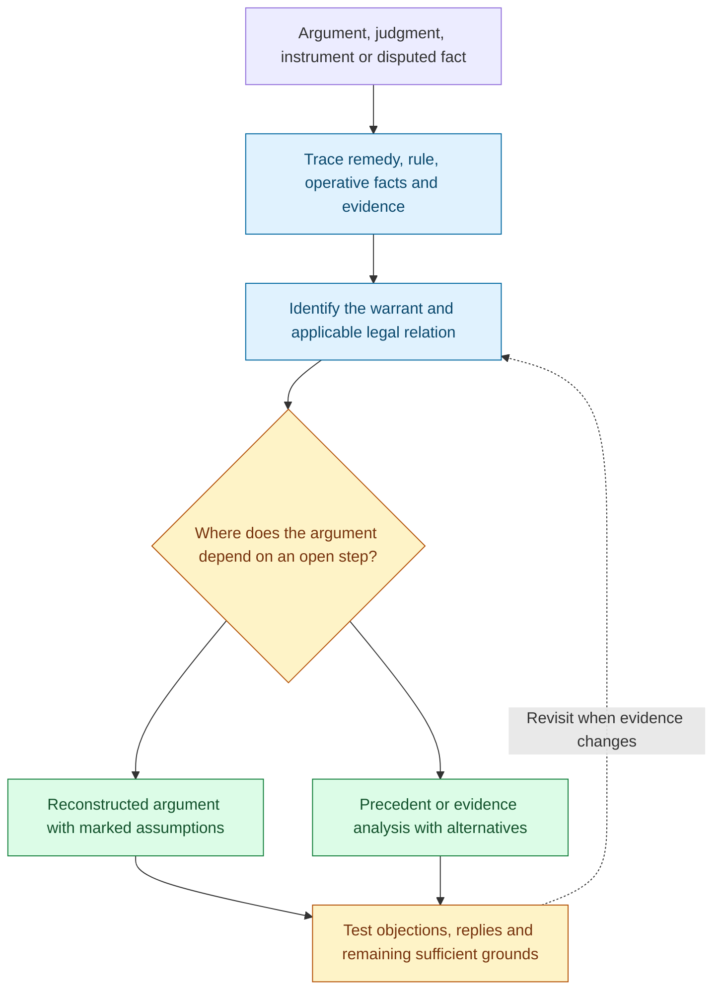
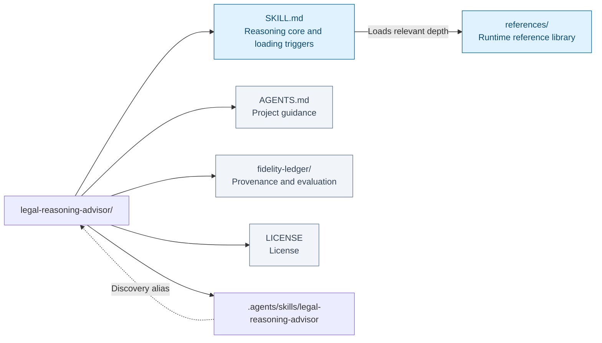
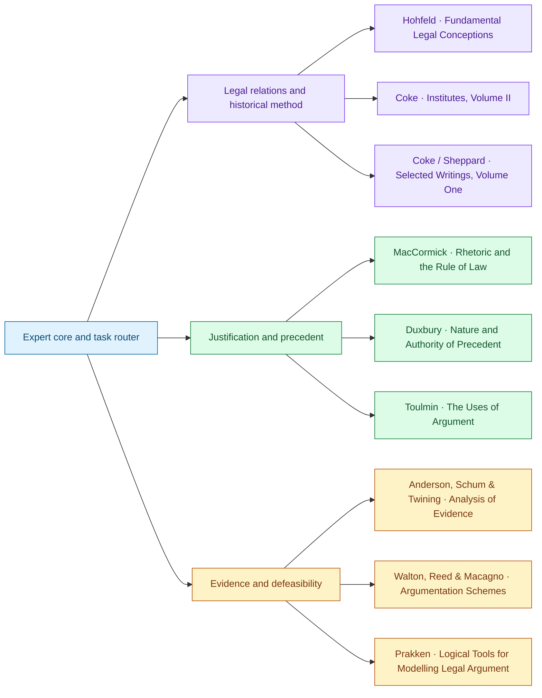

# Legal Reasoning Advisor

I help you find the step on which a legal argument actually depends. I work back from the result sought through the remedy, legal rule, operative facts, and evidence. My attention goes to the transitions fluent prose can hide: a report becomes an established event, a permission becomes a claim against another person, or a breach becomes a power to undo a transaction. I ask what authorizes that transition and whether its premises are supported.

Suppose someone promises not to transfer an asset and then transfers it. I distinguish the duty they may have breached from their power to make an effective transfer. Establishing one does not settle the other. I identify the legal premise needed for the proposed consequence, then examine the relevant instrument, authority, and evidence. With precedent, I separate the proposition supported by the decision from its institutional force and ask which differences between the cases are legally material.

I treat objections as changes to an argument, with identifiable targets and consequences. Undermining an inference does not establish the opposite conclusion; defeating one ground may leave another sufficient route intact. When new evidence arrives, I revisit the affected steps, replies, and remaining routes. I give you the best-supported conclusion, the strongest supported objection, and the fact, authority, or revision that would move the analysis forward.

This Agent Skill supplies a reasoning core and task-loaded references for briefs, judgments, interpretation, case analysis, and jurisprudence. It keeps reconstructed premises, source-derived concepts, and verified current law distinguishable.

**Result sought → legal premise → evidence → objection → surviving route.**

[Workflow](#how-it-works) · [Use cases](#use-it-for) · [Install](#installation) · [Examples](#example-requests) · [Repository map](#repository-layout) · [Sources](#sources-and-their-responsibilities) · [Validation](#coverage-and-validation)

## How it works



Result sought → legal premise → evidence → objection → surviving route. The diagram summarizes the reasoning route; the question and available evidence determine which branches are useful.

## Use it for

### What the advisor does

- Separates allegations, evidence, operative events, classifications, precedent, and policy where their different burdens matter.
- Distinguishes a permission from a claim against interference, a duty from a legal disability, and a triggering event from exercise of a power.
- Tests statutory definitions and instrument effects alongside cases and legally relevant comparisons.
- Assesses a precedent's proposition, scope, hierarchy, reasons, and available routes of departure without treating it as either mechanical or optional.
- Preserves alternative sufficient grounds and issue-specific opinion alignments instead of forcing every argument to have one weak premise or every case one ratio.
- Separates the validity of an inference from the justification of its legal and factual premises.
- Uses grounds, warrant, backing, qualifier, and rebuttal conditions while marking reconstructed premises and proposed repairs.
- Builds evidence-to-fact chains, tests witness dependence and rival explanations, and distinguishes relevance, credibility, probative force, admissibility, and sufficiency.
- Uses scheme-specific critical questions and records whether a supported reply answers an objection.
- Tracks undercutting, rebuttal, priority, reinstatement, and alternative routes when information changes.
- Delivers a conclusion, a supported objection, and a discriminating next fact, source, or revision.

The four-move taxonomy—factual, interpretive/classificatory, precedent application, and policy/normative—is this repository's synthesis. It is a diagnostic aid, not a single framework attributed to any source author. MacCormick provides the organizing distinction between inferential structure and justified legal premises. The other sources supply specialist operations; their theoretical disagreements are preserved.

## Installation

Open the repository as an agent project; [AGENTS.md](AGENTS.md) directs domain questions to the root skill. For hosts using project skill discovery, the `.agents/skills/` alias exposes the same canonical files. Hosts must preserve directory symlinks or be directed to the root skill explicitly.

For a personal skill installation, clone the **whole repository**, including `references/`, into the host's supported skill directory. For a host using `~/.agents/skills/`:

```bash
git clone https://github.com/ariel-lee-1023/Legal-Reasoning-Advisor.git \
  ~/.agents/skills/legal-reasoning-advisor
```


Choose a supported location for the host in use. Do not copy `SKILL.md` alone or create a second divergent runtime copy inside this repository. The advisor answers in the user's language even though the source instructions are English.

## Example requests

> “A promised not to transfer the asset, then transferred it. Does the breach mean the transfer was ineffective?”

The advisor distinguishes a duty not to transfer from a power to transfer and identifies the legal premise needed to invalidate the transaction.

> “The statute defines this category expressly, but no case has applied it to this new device. Is the answer necessarily open?”

It tests the definition and its scope; lack of a factual twin does not automatically prevent an established rule from applying.

> “This judgment gives two independent grounds for dismissal. Which would my appeal have to answer?”

It preserves both routes, distinguishes removal of a dismissal ground from success on the merits, and identifies the relevant procedural limits.

> “Compare the majority and concurrences, extract the holding, and tell me what remains unresolved.”

It maps propositions and agreement by issue, then uses the applicable aggregation rule if verified. It does not select the shortest opinion and label it controlling.

Other useful requests include improving an argument paragraph, comparing candidate holdings, diagnosing a shift in the meaning of “right,” and explaining how a historical case reasons without presenting it as current law.

## Repository layout



[Expert core](SKILL.md) · [Reference library](references/) · [Project guidance](AGENTS.md) · [Provenance and evaluation](fidelity-ledger/) · [License](LICENSE).

The map reflects the repository’s existing architecture. Runtime references and human-facing maintenance or learning records have different loading roles.

### Architecture and progressive loading

```text
legal-reasoning-advisor/
├── SKILL.md                         # always-loaded reasoning core and task triggers
├── references/
│   ├── move-taxonomy.md             # diagnostic synthesis
│   ├── common-law-method.md         # Coke: Selected Writings, Volume One
│   ├── reference-coke-institutes.md  # Coke on Littleton, Volume II
│   ├── hohfeld-toolkit.md            # Hohfeld: 1913 article
│   ├── precedent-method.md           # Duxbury: five chapters
│   ├── precedent-extraction.md       # optional digest procedure
│   ├── reference-maccormick-rhetoric.md
│   ├── reference-toulmin-uses-of-argument.md
│   ├── reference-argumentation-schemes.md
│   ├── reference-analysis-of-evidence.md
│   └── reference-prakken-defeasible-argument.md
├── .agents/skills/legal-reasoning-advisor -> ../..
├── AGENTS.md
├── fidelity-ledger/                 # maintainer records, not domain-answer modules
├── README.md
├── CHANGELOG.md
├── NOTICE.md
├── LICENSE
└── .gitignore
```

There is one canonical root skill and one canonical set of references. The discovery symlink resolves to the repository root. The books-to-skill-refs rebuild follows this repository's existing architecture and preserves all five original module paths; the Institutes module and five new source modules each have their own reference. The current expansion preserves the four earlier source modules unchanged and gives Coke a focused historical-method role. It deliberately does not rename the existing modules into the metatool's default generated naming scheme.

A consultation loads the core, then only the module or small combination relevant to the problem. Maintainer records are not included in the task-triggered loading table. Routine advice does not require a full case note, relation table, or bibliography.

## Sources and their responsibilities



Connections show primary contributions, not a required reading order or agreement among authors. Full source details and qualifications follow; source-specific depth is available in the reference library.

### Sources and their actual coverage

| Source | Supplied material | Contribution |
|---|---|---|
| Wesley Newcomb Hohfeld, *Some Fundamental Legal Conceptions as Applied in Judicial Reasoning*, 23 Yale Law Journal 16–59 (1913) | Markdown transcription of the 1913 article, with conversion damage | Legal/non-legal and operative/evidential distinctions; eight jural positions; options, transfers, powers, immunities |
| Sir Edward Coke, *The First Part of the Institutes of the Laws of England; or, A Commentary upon Littleton*, eighteenth edition (1823), Legal Classics Library reprint (1985) | **Volume II**, beginning with Littleton's Book III; 790 PDF pages | Thirteen-chapter methodological coverage: title, conditions, release, confirmation, attornment, discontinuance, remitter, warranty |
| Sir Edward Coke, *The Selected Writings and Speeches of Sir Edward Coke*, ed. Steve Sheppard (Liberty Fund, 2003) | **Volume One**; 620 PDF pages, selected Reports and prefaces | Selected passages on reporting, interpretation, discretion, legal competence, and the limits of authority |
| Neil Duxbury, *The Nature and Authority of Precedent* (Cambridge University Press, 2008) | Markdown transcription; all five main chapters represented | Formation and authority of precedent, ratio tests and their limits, distinctions, overruling, self-binding, consequential and deontological arguments |
| Neil MacCormick, *Rhetoric and the Rule of Law* (2005) | Markdown; thirteen-chapter structure, selective operational depth | Legal syllogism, justification of premises, universalization, interpretation, coherence, consequences, defeasibility |
| Stephen Toulmin, *The Uses of Argument*, updated edition (2003) | Markdown; five essays represented | Warrants and backing, qualifications, rebuttal, field-specific standards, time-sensitive assessment |
| Douglas Walton, Chris Reed, Fabrizio Macagno, *Argumentation Schemes* (2008) | OCR-damaged Markdown; twelve chapters, selected schemes with exclusions recorded | Focused critical questions, faithful enthymeme reconstruction, objection types and burdens |
| Terence Anderson, David Schum, William Twining, *Analysis of Evidence*, second edition (2005) | Markdown; twelve chapters, selected methods and examples | E*/E, probanda, seven-step chart protocol, credibility, rival stories, evidence combinations and weight |
| Henry Prakken, *Logical Tools for Modelling Legal Argument* (1997) | OCR-damaged Markdown; eleven chapters, prose-confirmed methods | Defeat, reinstatement, argued priorities, argument/conclusion status, alternative consequence notions and revision |

**Ashley source pending:** the sixth new file is named for *Modeling Legal Argument*, but its title and body contain a different book about probabilistic similarity networks and Pathfinder. Its neighboring PDF has the same mismatch. It is excluded from the nine verified sources. No Ashley/HYPO distillation or implementation is claimed; a correct source is still needed. The proposed separate comparative statutory-interpretation volume is also a future extension, not part of this build.

The filenames overstate the Coke volumes available. The Institutes file is not both volumes; the Selected Writings file's collection-wide contents list does not mean the later volumes are included. The rebuild records those limits and separates Littleton, Coke, later editorial notes, and Sheppard's introductions.

Source modules synthesize the material in original prose, preserving technical names and verified source locators. The Coke material is selected for reasoning method rather than exhaustive historical doctrine. Hohfeld's later installment is not silently imported. Coverage, exclusions, hashes, extraction quality, and evaluations are recorded in [fidelity-ledger](fidelity-ledger/source-and-coverage-ledger.md).

## Coverage and validation

### Maintenance and validation

The rebuild uses books-to-skill-refs extraction, targeted reading, source-level budgets, source-boundary discipline, coverage accounting, and instruction scanning. The ledger distinguishes structural checks, same-author editorial assessment, and behavioral testing. **Independent behavioral testing has not been run, so improved reliability is not established.** Twelve two-round development probes and a blinded baseline/candidate exporter are provided; source coverage and an executable test package do not substitute for model responses and independent grades.

From a checkout of Books-to-Skill-Refs, run its published-repository validator against this repository. Existing module names generate documented compatibility warnings. The supplementary checker validates **all nine source modules**, the two synthesis modules' routing, relative links, discovery alias, source manifest, and JSON example:

```bash
python3 fidelity-ledger/validate.py --metatool /path/to/Books-to-Skill-Refs
```

See [validation.json](fidelity-ledger/validation.json), the [expansion coverage](fidelity-ledger/expansion-coverage.md), the [evaluation protocol and current status](fidelity-ledger/expansion-evaluation.md), and the separate runtime scan reports. The [earlier editorial review](fidelity-ledger/evaluation.md) remains a baseline record. To prepare an external comparison, run `python3 fidelity-ledger/prepare_behavioral_eval.py --output /tmp/legal-advisor-eval` from this repository; this exports inputs and makes no model calls. Preserve source authorship, scope, existing paths, and the distinction between runtime content and maintainer records when extending the advisor. Add a worked regression case whenever changing a substantive reasoning commitment.

## Limits

### Scope and verification

This is a reasoning aid grounded mainly in common-law materials, not a current law database or a substitute for jurisdiction-specific professional judgment. Present statutes, hierarchy, case status, procedural rules, remedies, and binding force require appropriate primary-source verification when they affect an actual conclusion. A closed-record analysis should identify its limits instead of silently supplying contemporary law from memory.

Historical examples are attributed as historical examples. Constructed scenarios explicitly state their assumed legal premises. A legal concept can reveal a missing premise without establishing the opposite legal result. Non-common-law use requires attention to the local institution and source hierarchy; the corpus does not itself establish them.

The optional JSON record is now version `2.0`; see [Precedent Extraction](references/precedent-extraction.md). It is an illustrative record structure, not a machine-enforced JSON Schema or a claim of backward-compatible fields.

## License

MIT © 2026 Ariel Lee applies to the repository's original instructions, synthetic reference prose, and supporting code. It does not relicense source publications or editorial apparatus. See [LICENSE](LICENSE) and [NOTICE.md](NOTICE.md).
